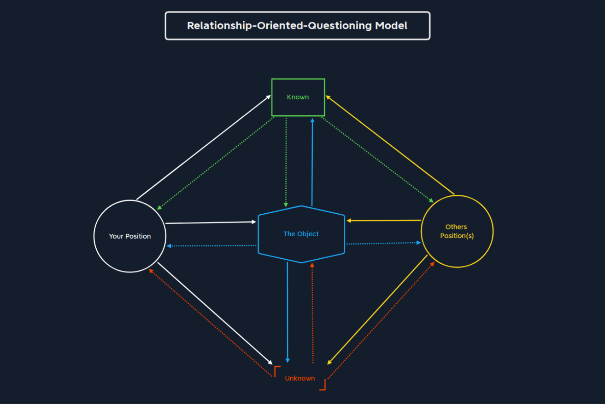
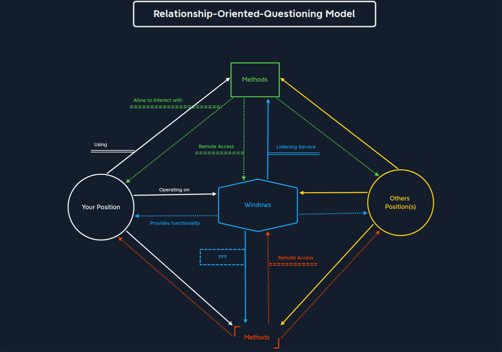

# Questions

## Overview

- Learning to ask the right questions.
- There is no good question or bad question.
- Only rough question and precise question.
  - Rough question: How can i hack X?
  - Precise question: How can i use the server's SMB to indentify the user?

### Relationship-Oriented-Questioning Model (ROQ)

- Image: 

| Component           | Description     |
|---------------------|---------------  |
| Your Postion        | This describes the postion we are in and out view.|
| The Object          | The object is the core element of this question. The question is the question we are asking.|
| Know                | This information is know to us.|
| Unknown             | This information is not know to us.|
| Orther Position(s)  | This component describes the position of orther persons.|

#### Example ROQ

