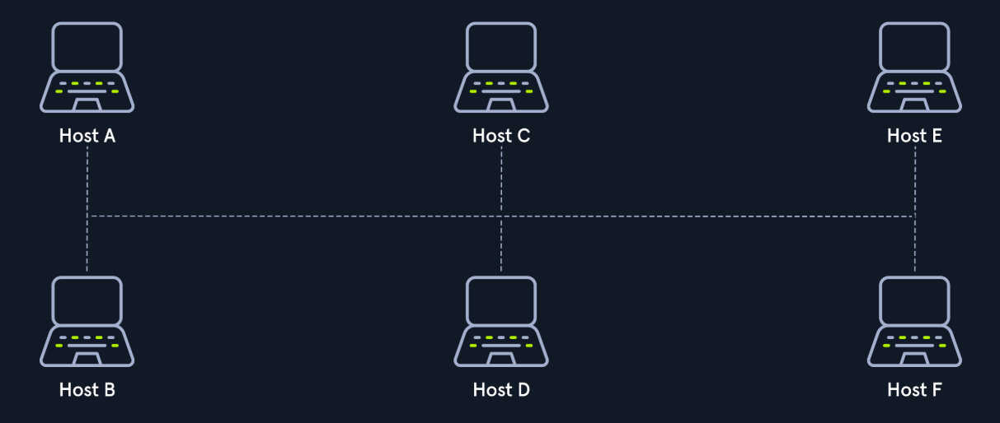
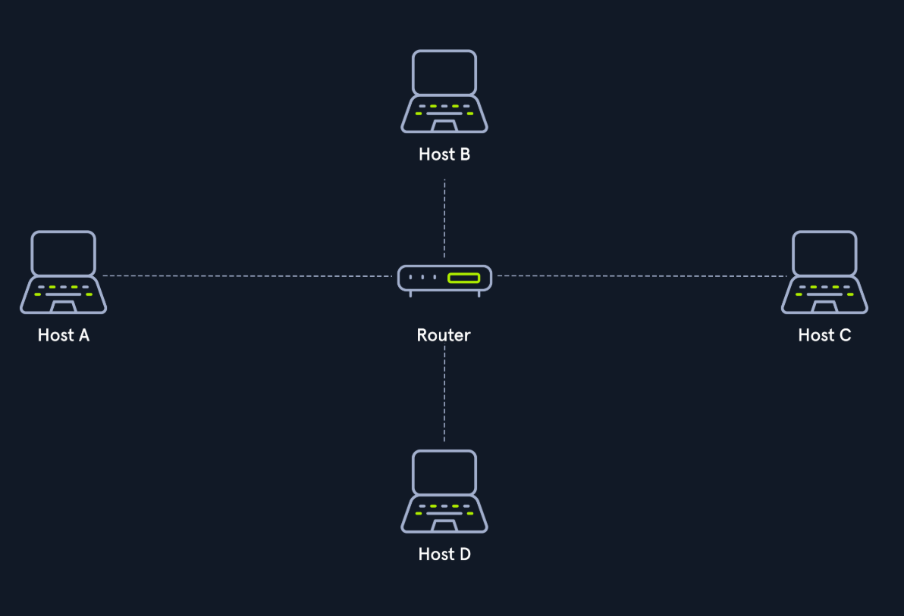
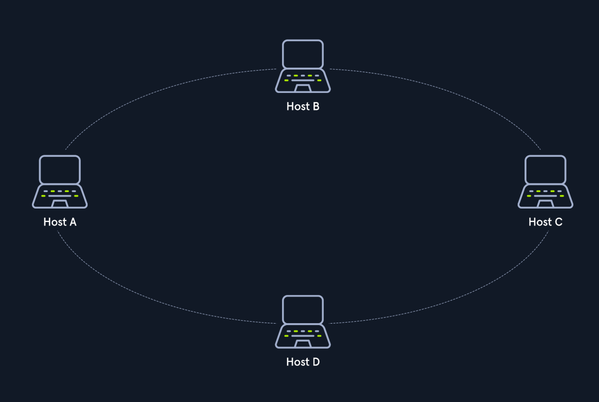
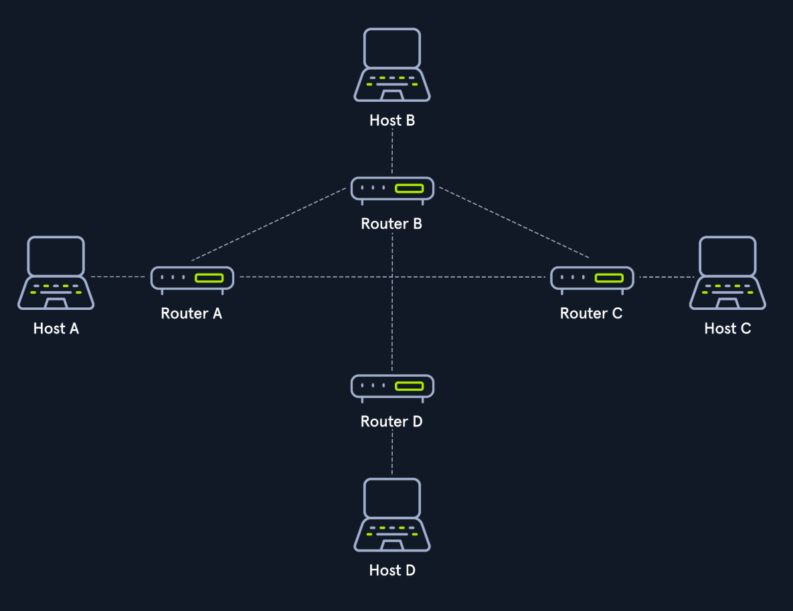
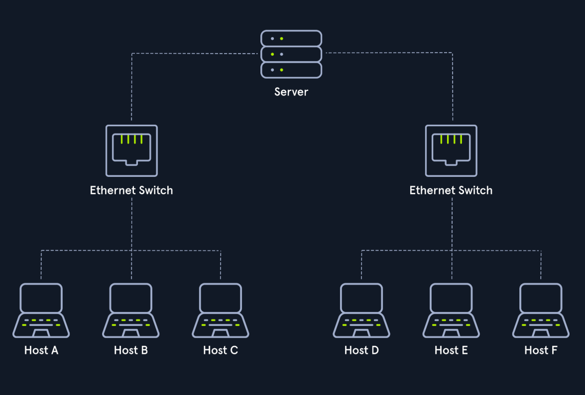
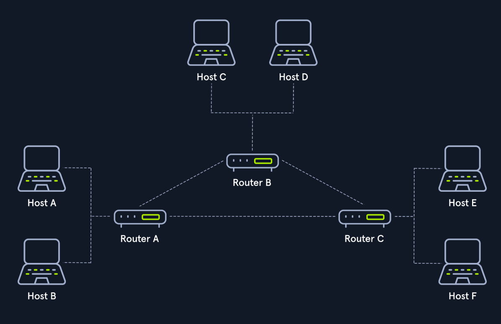
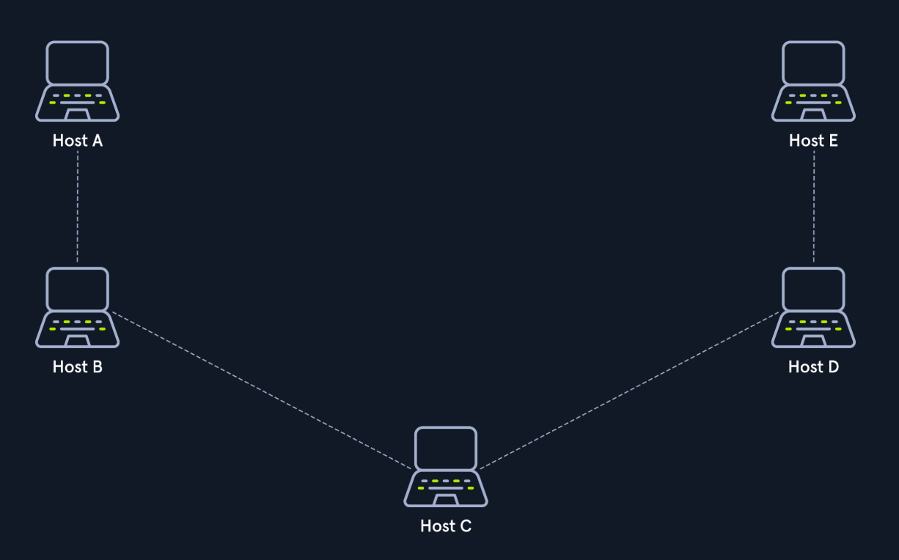

# Summary

- Network topologies is a typical arrangement and physical or logical connection of devices in a network.

## Key Points

- Connections

| Wired connections   | Wireless connections    |
|--------------- | --------------- |
| Coacial cabling   | Wi-Fi   |
| Glass fiber cabling   | Cellular   |
| Twisted-pair cabling   | Satellite   |
| and orther   | and orther   |

- Nodes - Network Interface Controllers (NICs)

| Repeaters | Hubs | Bridges | Switches |
| --------------- | --------------- | --------------- | --------------- |
| Router/Modem | Gateways | Firewalls |  |

- Classifications

| Structure  |
| --------------  |
|  |
|  |
|             |
| |
|             |
| |
|           |
| |

### Quote

#### Reflection

- How does this connect to my exist note or ideas?.
- Potential permanent notes to create from this source.

##### Related Notes
