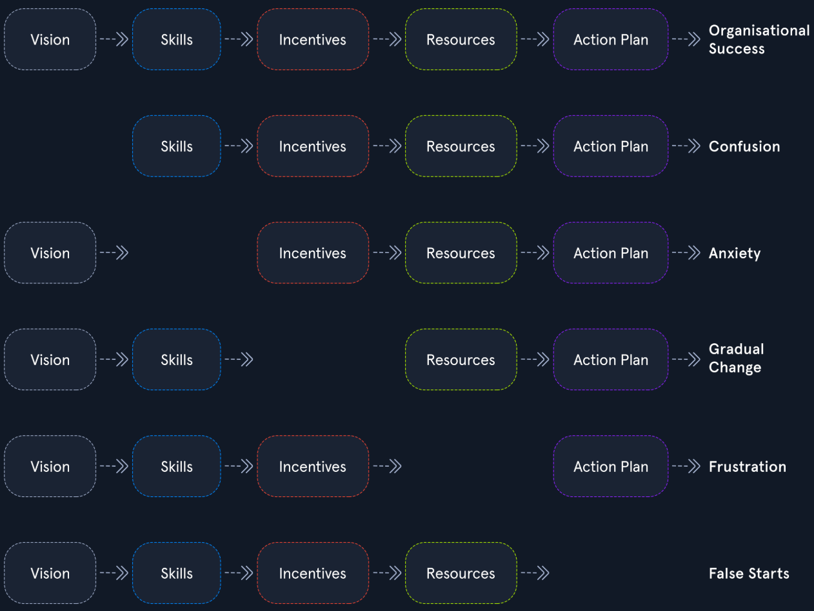

## Source Info

- Author: HackTheBox
- Type:Article

## Summary

- Mindset
  1. Way of thinking (Think to what is most important)
  2. Think outside the box (Forget about the limitations)
  3. Occam's Razor (The simplest solution is the best)
  4. Talents (Develop your talents)

- Learning dependencies
  1. Way of learning (Know my goal)
  2. Learning efficciency (Learn fast,80/20 rule, repeat, failure is the key to success)
  3. Learning type (Passive learning, Active learning)
  4. The brain (Develop every part of the brain)
  5. The will (Strong will)
  6. The goal (Clear, specific, precise goal. Measurable)
  7. Decision making

- Learning overview
  1. Documentation (Overview, Structure, Clarity)
  2. Organizaiton

- The process
  1. Focus
  2. Attention
  3. Comfort
  4. Obstacles
  5. [[Questions]]
  6. Handling Frustration
    1 

### Key Points

#### Quote

- A problem is a emotional state, Without emotions, it is just a situation.

##### Reflection

- How does this connect to my exist note or ideas?.
- Potential permanent notes to create from this source.

###### Related Notes
